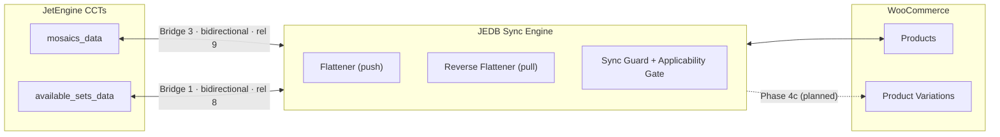

# DATA-MAP — Field mapping reference (Brick Builders HQ)

> **Purpose:** one place to SEE where every piece of data flows between JetEngine CCTs and WooCommerce, so future mapping changes are visually easy to reason about. One "card" per bridge, mirroring what the Flatten admin tab stores.
>
> **This is a manual snapshot** of the live staging config — it does not auto-update. Refresh it whenever a bridge changes. Regenerate the raw data with:
>
> ```sql
> SELECT id, label, source_target, target_target, direction, enabled, config_json
> FROM wp_jedb_flatten_configs;
> ```
>
> **Snapshot date:** 2026-07-12 · **Plugin version:** v0.6.0-alpha.21 · **Site:** bbhq.legworklabs.com (staging)

---

## System overview



- **Push** (CCT → WC) fires on JE `created-item` / `updated-item`. Order: field mappings → taxonomy rules → *(Phase 4c: variation reconcile)*.
- **Pull** (WC → CCT) fires on `woocommerce_update_product`. The **applicability gate** (§4.13 / D-28) makes each bridge skip targets outside its category — this is what keeps the two bridges below from stepping on each other.

---

## Bridge 3 — "Mosaics ← Product (pull test)"

| | |
|---|---|
| **DB id / slug** | 3 / `cct-mosaics_data__posts-product__bidirectional` |
| **Source ↔ Target** | `cct::mosaics_data` ↔ `posts::product` |
| **Direction** | bidirectional · **Enabled** ✅ |
| **Link** | JE Relation **9** (Mosaic → Product, one_to_one), side auto, fallback-to-single-page ✅, auto-attach ✅ |
| **Applicability (auto-derived)** | `product_cat` has any of **[mosaics]**, match by slug, applies to **pull** |
| **Auto-create** | target (product) on push: ✅ · source (CCT) on pull: ❌ (post-alpha.21 default) |
| **Meta box** | "Moasics Data surface" (normal, advanced hidden) |
| **CCT-screen panel** | WC Variations "Variations Management" — enabled, full-page mode, no auto-force-variable |

### Field mappings

| CCT field (mosaics_data) | → | WC product field | Push transform | Pull transform | Surfaced |
|---|---|---|---|---|---|
| `mosaic_name` | ↔ | `name` (product title) | passthrough | passthrough | — |
| `theme_idea` | ↔ | `category_ids` | `term_lookup` (product_cat, slug → ids_array, no create) | passthrough | — |
| `gallery` | — | *(no target field)* | — | — | ✅ on product meta box |
| `gallery` | ↔ | `gallery_image_ids` | passthrough | passthrough | — |
| `main_photo` | ↔ | `image_id` (featured image) | passthrough | passthrough | — |

### Taxonomy rules (push-only)

| Taxonomy | Apply | Inverse (remove) | Match | Strategy |
|---|---|---|---|---|
| `product_cat` | `mosaics` | `available-sets` | slug | replace |

---

## Bridge 1 — "Available Sets data to Products"

| | |
|---|---|
| **DB id / slug** | 1 / `cct-available_sets_data__posts-product__bidirectional` |
| **Source ↔ Target** | `cct::available_sets_data` ↔ `posts::product` |
| **Direction** | bidirectional · **Enabled** ✅ |
| **Link** | JE Relation **8** (Available Set → Product, one_to_one), side auto, fallback ✅, auto-attach ✅ |
| **Applicability (auto-derived)** | `product_cat` has any of **[available-sets]**, match by slug, applies to **pull** |
| **Auto-create** | target on push: ✅ · source on pull: ❌ |
| **Meta box** | default title (bridge label), normal, advanced hidden |
| **CCT-screen panel** | WC Variations — disabled |

### Field mappings

| CCT field (available_sets_data) | → | WC product field | Push transform | Pull transform | Surfaced |
|---|---|---|---|---|---|
| `price` | ↔ | `regular_price` | `format_number` (3 decimals, string) | passthrough | — |
| `main_photo` | ↔ | `image_id` (featured image) | passthrough | passthrough | — |

### Taxonomy rules (push-only)

| Taxonomy | Apply | Inverse (remove) | Match | Strategy |
|---|---|---|---|---|
| `product_cat` | `available-sets` | `mosaics` | slug | replace |

---

## Bridge 2 — "Mosaics to Product" *(DISABLED — legacy)*

Push-only early test bridge (`mosaic_name → name`, `price → regular_price`, condition `{cct.display_price_publicly} == "yes"`). Disabled since 2026-05-06. Kept as reference; delete when convenient.

---

## WooCommerce attributes (standardized 2026-07-12)

| Attribute | Taxonomy | Terms | Used by |
|---|---|---|---|
| Physical or PDF | `pa_physical-or-pdf` | `physical-art`, `instructions-pdf` | all 8 variable products (variation discriminator) |
| Variant *(planned — Phase 4c)* | `pa_variant` | per-row `variant_label` terms | distinguishes multiple physical variations |

All legacy attribute identities (`physical-vs-instructions-pdf`, `physical-or-instructions-pdf`, dead taxonomy `pa_physical-or-pdf-instructions`) were migrated + purged on 2026-07-12.

---

## PLANNED — Phase 4c repeater → variation mappings (spec: BUILD-PLAN §4.14)

> **Sync not yet implemented.** The CCT repeater fields themselves WERE created on staging 2026-07-12 via MCP (JE schema on `mosaics_data`: `physical_variations` with 12 subfields, `pdf_variations` with 7 subfields — both verified readable by JE's factory and JEDB's CCT adapter). The `pa_variant` WC attribute and everything below the tables (reconciler, `variation_mappings[]` block) ship with Phase 4c-A.

### `physical_variations` repeater (mosaics_data) → WC variations

Each row = one physical variation. Identity: hidden `_jedb_row_id` UUID ↔ variation `_jedb_variation_slug` meta. Attribute combo: `pa_physical-or-pdf=physical-art` + `pa_variant={variant_label}`.

| Repeater subfield | → | WC variation field | Direction |
|---|---|---|---|
| `variant_label` (66% width) | → | `pa_variant` term | push |
| `enabled` (switch, default ON) | → | variation status (off → private) | push |
| `regular_price` (fallback: parent `price`) | → | `regular_price` | push |
| `on_sale` (UI gate — reveals the sale row; not mapped directly, reconciler clears sale fields when "no") | → | — | push (gate only) |
| `sale_price` (visible when on_sale=yes) | → | `sale_price` | push |
| `sale_start` / `sale_end` (visible when on_sale=yes) | → | `date_on_sale_from` / `date_on_sale_to` | push (date transform) |
| `stock_quantity` | ↔ | `stock_quantity` (+ manage_stock=yes) | **two-way** (pull = Phase 4c-B) |
| `length` / `width` / `height` (inches) + `weight` (lbs) — matches WC store units (in / lbs) | → | same | push |
| `sku` | → | `sku` | push |

### `pdf_variations` repeater (mosaics_data) → WC variations

Attribute combo: `pa_physical-or-pdf=instructions-pdf` (+ Any variant). Defaults: `virtual=yes`, `downloadable=yes`, no stock.

| Repeater subfield | → | WC variation field | Direction |
|---|---|---|---|
| `variant_label` (default "Instructions PDF") | → | (label only) | push |
| `enabled` (switch, default ON) | → | variation status | push |
| `file` (media/PDF) | → | `downloads[]` | push |
| `price` | → | `regular_price` | push |
| `on_sale` (UI gate) | → | — | push (gate only) |
| `sale_price` + schedule (visible when on_sale=yes) | → | sale fields | push |

---

## Maintenance checklist

When you change a bridge in the Flatten admin tab, update the matching card here:

1. Mapping added/removed/re-transformed → edit the bridge's **Field mappings** table.
2. Taxonomy rule changed → **Taxonomy rules** table (and remember the applicability gate may auto-derive from it).
3. Direction / link / auto-create flags changed → the bridge's header card.
4. New bridge → copy a card as template.
5. Phase 4c ships → move the PLANNED section into the Bridge 3 card and update the snapshot date.
