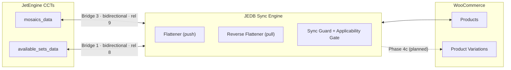
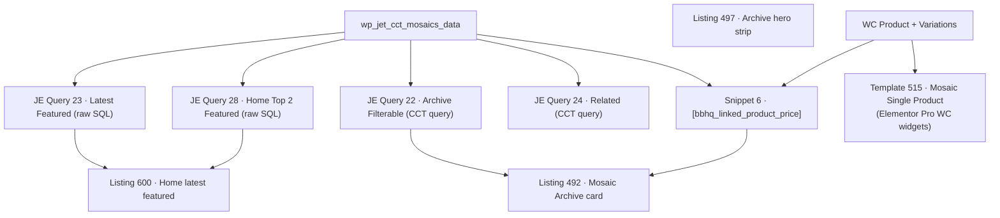

# DATA-MAP — Field mapping reference (Brick Builders HQ)

> **Purpose:** one place to SEE where every piece of data flows between JetEngine CCTs and WooCommerce, so future mapping changes are visually easy to reason about. One "card" per bridge, mirroring what the Flatten admin tab stores.
>
> **This is a manual snapshot** of the live staging config — it does not auto-update. Refresh it whenever a bridge changes. Regenerate the raw data with:
>
> ```sql
> SELECT id, label, source_target, target_target, direction, enabled, config_json
> FROM wp_jedb_flatten_configs;
> ```
>
> **Snapshot date:** 2026-07-12 · **Plugin version:** v0.6.0-alpha.21 · **Site:** bbhq.legworklabs.com (staging)

---

## System overview



- **Push** (CCT → WC) fires on JE `created-item` / `updated-item`. Order: field mappings → taxonomy rules → *(Phase 4c: variation reconcile)*.
- **Pull** (WC → CCT) fires on `woocommerce_update_product`. The **applicability gate** (§4.13 / D-28) makes each bridge skip targets outside its category — this is what keeps the two bridges below from stepping on each other.

---

## Bridge 3 — "Mosaics ← Product (pull test)"

| | |
|---|---|
| **DB id / slug** | 3 / `cct-mosaics_data__posts-product__bidirectional` |
| **Source ↔ Target** | `cct::mosaics_data` ↔ `posts::product` |
| **Direction** | bidirectional · **Enabled** ✅ |
| **Link** | JE Relation **9** (Mosaic → Product, one_to_one), side auto, fallback-to-single-page ✅, auto-attach ✅ |
| **Applicability (auto-derived)** | `product_cat` has any of **[mosaics]**, match by slug, applies to **pull** |
| **Auto-create** | target (product) on push: ✅ · source (CCT) on pull: ❌ (post-alpha.21 default) |
| **Meta box** | "Moasics Data surface" (normal, advanced hidden) |
| **CCT-screen panel** | WC Variations "Variations Management" — enabled, full-page mode, no auto-force-variable |

### Field mappings

| CCT field (mosaics_data) | → | WC product field | Push transform | Pull transform | Surfaced |
|---|---|---|---|---|---|
| `mosaic_name` | ↔ | `name` (product title) | passthrough | passthrough | — |
| `theme_idea` | ↔ | `category_ids` | `term_lookup` (product_cat, slug → ids_array, no create) | passthrough | — |
| `gallery` | — | *(no target field)* | — | — | ✅ on product meta box |
| `gallery` | ↔ | `gallery_image_ids` | passthrough | passthrough | — |
| `main_photo` | ↔ | `image_id` (featured image) | passthrough | passthrough | — |

### Taxonomy rules (push-only)

| Taxonomy | Apply | Inverse (remove) | Match | Strategy |
|---|---|---|---|---|
| `product_cat` | `mosaics` | `available-sets` | slug | replace |

---

## Bridge 1 — "Available Sets data to Products"

| | |
|---|---|
| **DB id / slug** | 1 / `cct-available_sets_data__posts-product__bidirectional` |
| **Source ↔ Target** | `cct::available_sets_data` ↔ `posts::product` |
| **Direction** | bidirectional · **Enabled** ✅ |
| **Link** | JE Relation **8** (Available Set → Product, one_to_one), side auto, fallback ✅, auto-attach ✅ |
| **Applicability (auto-derived)** | `product_cat` has any of **[available-sets]**, match by slug, applies to **pull** |
| **Auto-create** | target on push: ✅ · source on pull: ❌ |
| **Meta box** | default title (bridge label), normal, advanced hidden |
| **CCT-screen panel** | WC Variations — disabled |

### Field mappings

| CCT field (available_sets_data) | → | WC product field | Push transform | Pull transform | Surfaced |
|---|---|---|---|---|---|
| `price` | ↔ | `regular_price` | `format_number` (3 decimals, string) | passthrough | — |
| `main_photo` | ↔ | `image_id` (featured image) | passthrough | passthrough | — |

### Taxonomy rules (push-only)

| Taxonomy | Apply | Inverse (remove) | Match | Strategy |
|---|---|---|---|---|
| `product_cat` | `available-sets` | `mosaics` | slug | replace |

---

## Bridge 2 — "Mosaics to Product" *(DISABLED — legacy)*

Push-only early test bridge (`mosaic_name → name`, `price → regular_price`, condition `{cct.display_price_publicly} == "yes"`). Disabled since 2026-05-06. Kept as reference; delete when convenient.

---

## WooCommerce attributes (standardized 2026-07-12)

| Attribute | Taxonomy | Terms | Used by |
|---|---|---|---|
| Physical or PDF | `pa_physical-or-pdf` | `physical-art`, `instructions-pdf` | all 8 variable products (variation discriminator) |
| Variant *(planned — Phase 4c)* | `pa_variant` | per-row `variant_label` terms | distinguishes multiple physical variations |

All legacy attribute identities (`physical-vs-instructions-pdf`, `physical-or-instructions-pdf`, dead taxonomy `pa_physical-or-pdf-instructions`) were migrated + purged on 2026-07-12.

---

## PLANNED — Phase 4c repeater → variation mappings (spec: BUILD-PLAN §4.14)

> **Sync not yet implemented.** The CCT repeater fields WERE created on staging 2026-07-12 via MCP (final schema on `mosaics_data`: `physical_variations` with 15 subfields incl. `photo` + `_jedb_row_id`, `pdf_variations` with 9 subfields). **Legacy data migration EXECUTED 2026-07-12:** all 10 mosaic rows now carry seeded/normalized repeater data (physical row from legacy `price`/`approximate_size` with stock=1; PDF row where `has_instructions_pdf=yes`, incl. the one real file → attachment 407), and `approximate_size` now holds the derived `L″ × W″` display string per §4.14.11 (frontend queries verified working post-migration). Legacy fields still present — retirement is Phase 4c-C. The `pa_variant` WC attribute and everything below (reconciler, `variation_mappings[]` block) ship with Phase 4c-A.

### `physical_variations` repeater (mosaics_data) → WC variations

Each row = one physical variation. Identity: hidden `_jedb_row_id` UUID ↔ variation `_jedb_variation_slug` meta. Attribute combo: `pa_physical-or-pdf=physical-art` + `pa_variant={variant_label}`.

| Repeater subfield | → | WC variation field | Direction |
|---|---|---|---|
| `variant_label` (66% width) | → | `pa_variant` term | push |
| `enabled` (switch, default ON) | → | variation status (off → private) | push |
| `regular_price` (fallback: parent `price`) | → | `regular_price` | push |
| `on_sale` (UI gate — reveals the sale row; not mapped directly, reconciler clears sale fields when "no") | → | — | push (gate only) |
| `sale_price` (visible when on_sale=yes) | → | `sale_price` | push |
| `sale_start` / `sale_end` (visible when on_sale=yes) | → | `date_on_sale_from` / `date_on_sale_to` | push (date transform) |
| `stock_quantity` | ↔ | `stock_quantity` (+ manage_stock=yes) | **two-way** ✅ (pull live since alpha.24 — admin edits + purchases via `woocommerce_variation_set_stock`) |
| `length` / `width` / `height` (inches) + `weight` (lbs) — matches WC store units (in / lbs) | → | same | push |
| `length`/`width`/`height` of FIRST enabled row | → | CCT `approximate_size` (derived display string, §4.14.11) | push (same pass) |
| `photo` (media — subfield added 2026-07-12) | → | `image_id` (variation image swap on storefront) | push |
| `sku` | → | `sku` | push |

### `pdf_variations` repeater (mosaics_data) → WC variations

Attribute combo: `pa_physical-or-pdf=instructions-pdf` (+ Any variant). Defaults: `virtual=yes`, `downloadable=yes`, no stock.

| Repeater subfield | → | WC variation field | Direction |
|---|---|---|---|
| `variant_label` (default "Instructions PDF") | → | (label only) | push |
| `enabled` (switch, default ON) | → | variation status | push |
| `file` (media/PDF) | → | `downloads[]` | push |
| `price` | → | `regular_price` | push |
| `on_sale` (UI gate) | → | — | push (gate only) |
| `sale_price` + schedule (visible when on_sale=yes) | → | sale fields | push |

---

## Frontend consumption map (audited 2026-07-12)

> Where mosaic CCT data is actually rendered on the storefront. **Check this section before renaming/dropping any CCT field** — these are the consumers that break.

### Render chain



> **⚠️ 2026-07-12 evening — Phase 4c-C field retirement EXECUTED.** Six columns DROPPED from `mosaics_data`: `is_there_only_1_product_size`, `has_instructions_pdf`, `instructions_pdf`, `approximate_size`, `stud_count`, `price` (snapshot: `uploads/jedb-4cc-retirement-snapshot-20260713-002101.json`). The repeaters gained `stud_count` + `hide_price` (physical) and `hide_price` (pdf). Frontend now derives size/studs/PDF-availability from the repeaters via **Snippet 18** (`[bbhq_mosaic_size]`, `[bbhq_mosaic_studs]`) + reworked **Snippet 9**; queries 23/28 SELECT lists were slimmed; listing 600 rebound. **Price display (Decision D):** per-variation `hide_price=yes` → "Quote on request" · else stock ≤ 0 → "Request a Commission" · else price. `display_price_publicly` gates the CARD only. Rows below that reference dropped columns are historical.

### Field → consumer table

| CCT field | Consumers | Notes |
|---|---|---|
| `mosaic_name` | Queries 23/28 (SELECT), listings 492/497/600 | + bridge-synced to product title |
| `approximate_size` | Queries 23/28 (**SELECT by column name**), listing 600 (home card), **Snippet 9** (Additional Info tab: "Approximate Size") | DERIVED cache since alpha.22 (§4.14.11). 4c-C plan: keep column, hide field from editors (§4.14.14 Decision A) |
| `price` | Queries 23/28 (SELECT — output unused by renderers), repeater `price_fallback_field` | **DROP planned** (§4.14.14) — card/product price flows from the WC product via Snippet 6, not this column. Pre-steps: per-row regular_price backfill + query SELECT slim-down + fallback removal |
| `display_price_publicly` | **Code Snippet 6** `[bbhq_linked_product_price]` — card gate ("Quote on request") | KEEP + EXTEND (§4.14.14 Decision D): variations-era gap — single product page price range/per-variation prices are ungated; plan adds a `woocommerce_get_price_html` + `woocommerce_available_variation` gate snippet |
| `stud_count` | Queries 23/28 (SELECT), **Snippet 9** (Additional Info tab: "Stud Count") | 4c-C plan: editing MOVES into a new repeater subfield (no WC sync); column stays as hidden derived cache (§4.14.14 Decision B) |
| `main_photo` | Listings 492/497/527/600, bridge → product `image_id` | parent/primary product photo |
| `gallery` | Query 23/28 (SELECT), bridge → product `gallery_image_ids` | product gallery |
| `has_instructions_pdf` | **Snippet 9** (Additional Info tab: "PDF Instructions: Available" when yes) — ⚠️ the first audit missed this (it's PHP, not Elementor data) | DROP after Snippet 9 derives the line from `pdf_variations` instead (§4.14.14) |
| `instructions_pdf`, `is_there_only_1_product_size` | zero frontend consumers | DROP list (§4.14.14 sequence step 7) |

### Single product page (variation UX)

- Template: **Elementor library post 515 "Mosaic Single Product"**, applied to `product_cat=mosaics` (term 17) via Elementor Pro theme-builder conditions. (Sets: post 532 / term 16.)
- Widgets: Elementor Pro's standard WC set — `woocommerce-product-images`, `woocommerce-product-add-to-cart` (renders the variation selector on variable products), price/stock/meta/tabs + a `jet-listing-grid` (related).
- **Per-variation photo swap: works natively.** WC variations carry their own `image_id`; core WC JS swaps the main image when a variation with an image is selected, restores the parent `main_photo`-fed featured image when cleared. The `woocommerce-product-images` widget wraps that native behavior. JetProductGallery is installed but not used on this template.
- Planned flow: parent image = `main_photo` (mapped today) · gallery = `gallery` (mapped today) · variation image = NEW `photo` subfield on `physical_variations` → variation `image_id` (adapter already supports the setter). PDF variations get no photo — parent image shows.

## Repeater storage format (verified against live data, item 16, 2026-07-12)

> **This is the ground truth for the Phase 4c reconciler.** Verified by reading the raw DB column for a real editor-saved row (mosaic 16 "Variation test 2", 2 physical rows + 1 PDF row).

### Where + how it's stored

- Each repeater = **one TEXT column** on `wp_jet_cct_mosaics_data`, named after the repeater field (`physical_variations`, `pdf_variations`).
- The value is a **PHP-serialized associative array — NOT JSON.** Read with `maybe_unserialize()`, write back with `serialize()`.
- Row keys are `item-0`, `item-1`, … — **positional, rebuilt from the form on every JE admin save.** They are NOT stable identity (reorder/delete renumbers them). Identity = the `_jedb_row_id` subfield, never the `item-N` key.

### Value types — everything is a string

| Subfield type | Stored as | Example from live data |
|---|---|---|
| text | string | `"18\" x 18\" Frame"` (embedded quotes are fine — PHP serialization is length-prefixed) |
| number | **string** | `"1500"`, `"1"` — cast before writing to WC |
| switcher | **string** `"true"` / `"false"` | `"true"` — NOT a boolean |
| select (glossary) | glossary value string | `"yes"` / `"no"` |
| date | `"YYYY-MM-DD"` string | `"2026-07-13"` |
| media | **attachment ID as string** | `"407"` |
| empty | `""` | empty string, never null |

### Decoded shape (item 16, abridged)

```php
array(
  'item-0' => array(
    'variant_label'  => '18" x 18" Frame',
    'enabled'        => 'true',
    'regular_price'  => '1500',
    'stock_quantity' => '1',
    'on_sale'        => 'no',
    'sale_price'     => '', 'sale_start' => '', 'sale_end' => '',
    'length'         => '18', 'width' => '18', 'height' => '', 'weight' => '',
    'sku'            => '',
    // '_jedb_row_id' => filled by the reconciler on first sync
  ),
  'item-1' => array( /* ... on_sale => 'yes', sale_start => '2026-07-13' ... */ ),
)
```

### Critical implementation notes for the Phase 4c reconciler

1. **`JEDB_Target_CCT::get()`/`get_fresh()` return the repeater column RAW** (the serialized string, not an array) — verified live. The reconciler must `maybe_unserialize()` the value itself.
2. **Row identity must be a real, defined subfield.** JE's `save_item()` (`item-handler.php`) rebuilds each repeater value from `$_POST` and sanitizes against the DEFINED `repeater-fields` list — any key that isn't a defined field with a form input is **stripped on every admin save**. That kills the original "invisibly inject a key into the JSON" plan (BUILD-PLAN §4.14.5, now amended). `_jedb_row_id` therefore exists as a real text subfield on both repeaters (added 2026-07-12); Phase 4c-A hides it via CSS on the CCT edit screen (JEDB already injects assets there) and fills empty ones server-side on first reconcile.
3. **Reverse writes (Phase 4c-B)** re-serialize the whole array with `serialize()` after surgically updating the target row's subfield, preserving the existing `item-N` keys, via direct SQL (L-030 pattern).
4. **Cast discipline:** numbers → `(float)`/`(int)` before WC setters; `enabled === 'true'` string compare; `on_sale === 'yes'` glossary compare; media ID → `(int)`.

## Maintenance checklist

When you change a bridge in the Flatten admin tab, update the matching card here:

1. Mapping added/removed/re-transformed → edit the bridge's **Field mappings** table.
2. Taxonomy rule changed → **Taxonomy rules** table (and remember the applicability gate may auto-derive from it).
3. Direction / link / auto-create flags changed → the bridge's header card.
4. New bridge → copy a card as template.
5. Phase 4c ships → move the PLANNED section into the Bridge 3 card and update the snapshot date.
